# FleGo

This project is a language learning app built with Angular framework.
Design for new comers in France who are interested in learning French.

## Features
- Learn french in real world situations, with QCM questions on readings, image - text matching, and listening to audio.
- 8 Categories: Daily life, Administration, Travel, Housing, Activities, Health, Love, Professional life
- A vocabulary list with explanations and example sentences, sorted by categories.
- Management of learning progress: global view of progress, reset progress, etc.

## Technical Points
### Build a responsive, mobile friendly web app with Angular framework and Angular Material UI
- Componentization: templates, directives and data bindings, dependency injection, NgModules
- First-party libraries: Angular forms, Angular router for lazy-loading, nested routes etc, Angular animations and transitions
### Backend: User registration, authentication, learning contents rich media API
- NodeJS + MongoDB based backend API, with Angular HttpClient for communications

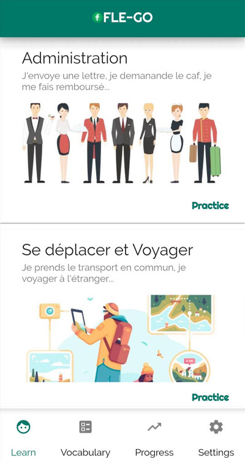
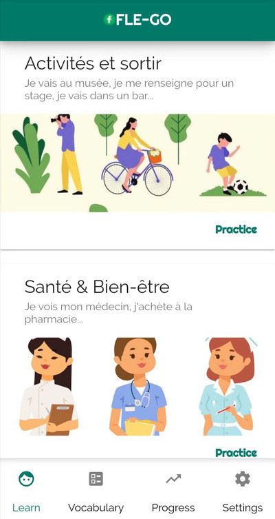
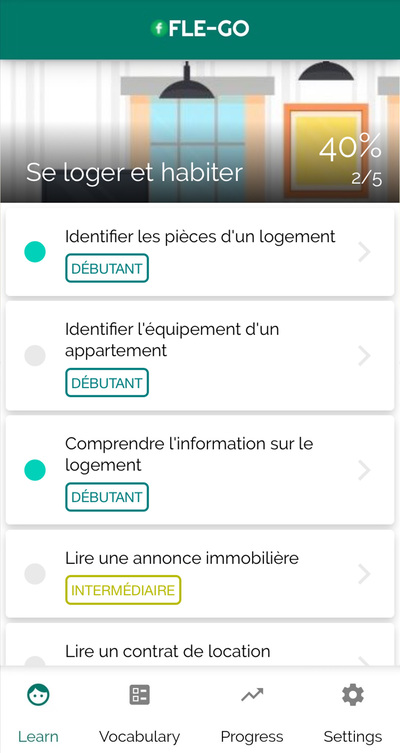
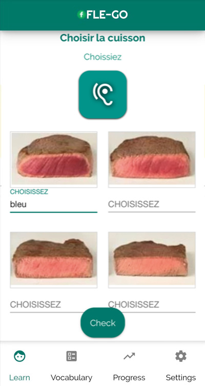
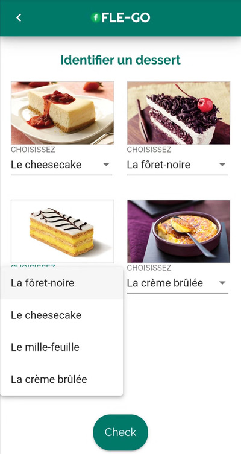
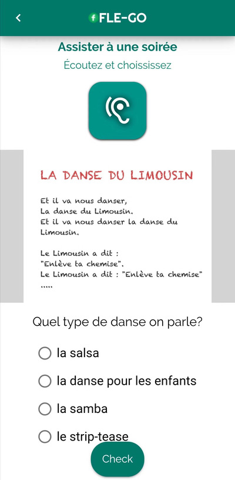
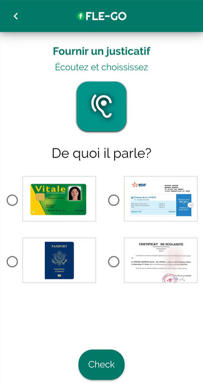
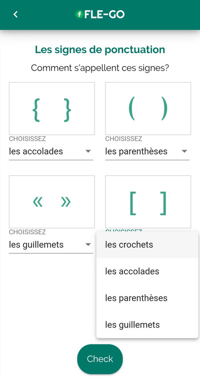
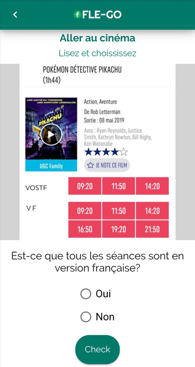
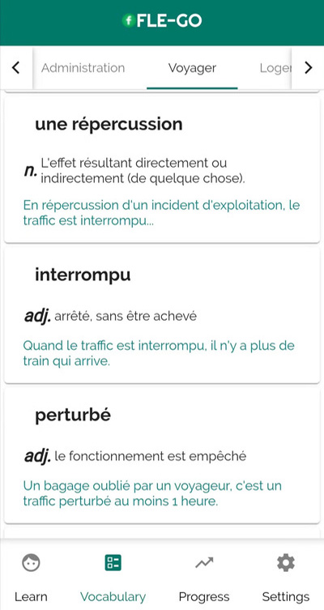
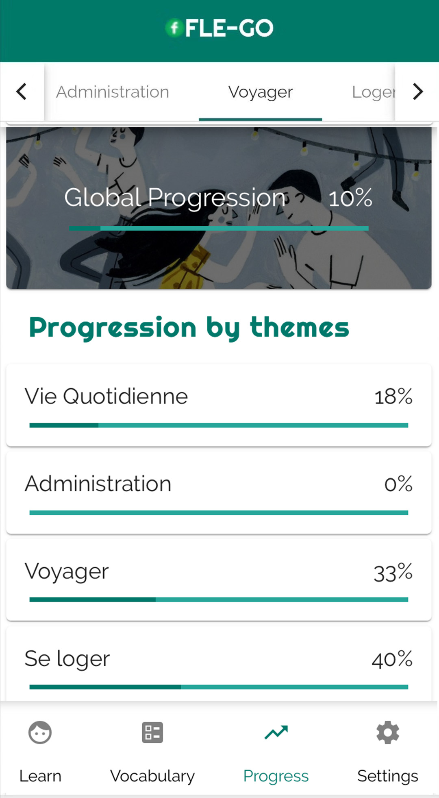

